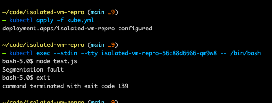

# Readme

Segfault in GKE

```sh
<= GKE 1.19.9-gke.1900 (did not test higher version)
Container-Optimized OS with Docker (cos)
e2-highcpu-4 => 3.92 CPU + 2.96 GB (intel lake)
```

## Repro Local (not docker not GKE)

> In local, it works correctly

```sh
yarn
node test.js
```

- ✅ Should NOT output `Segmentation fault`
- ✅ Should output `Maximum call stack size exceeded`

## Repro Docker

```sh
yarn dev:build
yarn docker:run
```

<http://localhost:8000> should answer "hello world"

```sh
docker exec -it isolated-vm-repro /bin/sh
```

```sh
# Inside the docker
node test.js
```

- ❌ Should NOT output `Segmentation fault`
- ❌ Should output `Maximum call stack size exceeded`

## Repro in GKE

```sh
git clone https://github.com/bodinsamuel/isolated-vm-repro.git

cd isolated-vm-repro

yarn

# Optional: The current image is already build and accessible
# You must replace sha256 in kube.yml
./build.sh

kubectl apply -f kube.yml

kubectl get pods

kubectl exec --stdin --tty <pod_name> -- /bin/bash

# Inside the pod
node test.js
```

- ❌ Should NOT output `Segmentation fault`
- ❌ Should output `Maximum call stack size exceeded`


